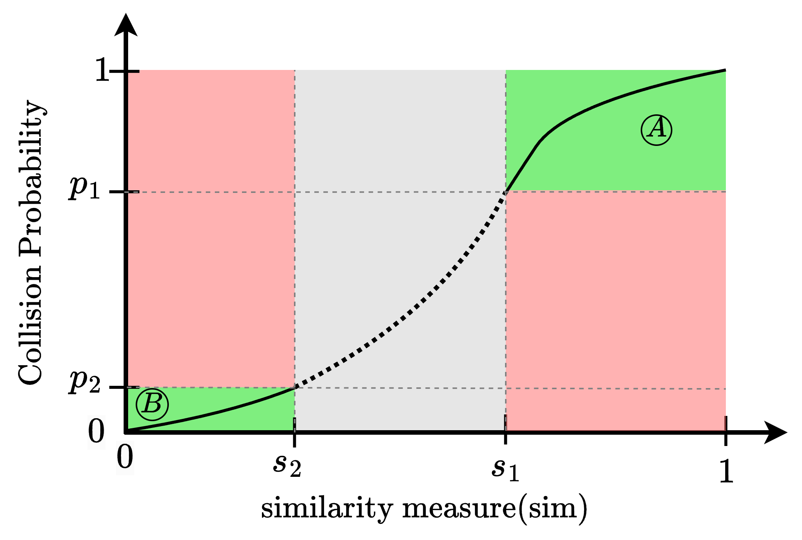
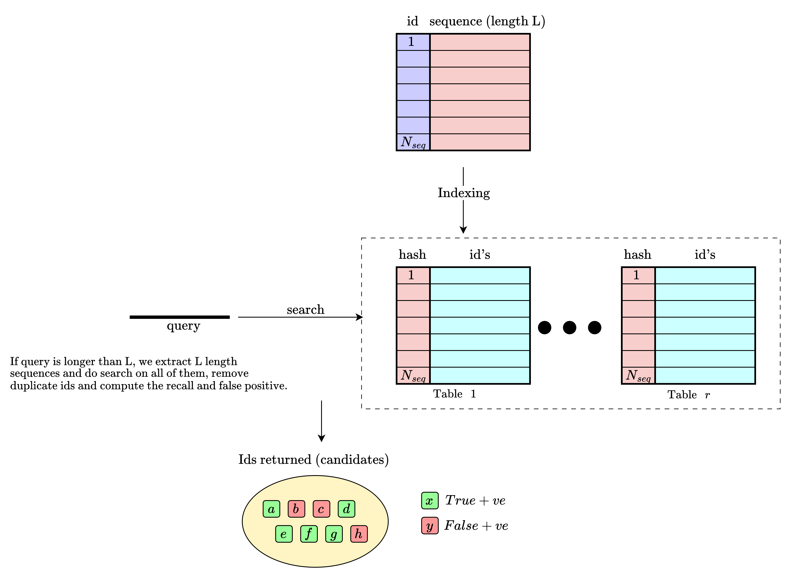

# BioHasher : Genomic Hash Function Testing Framework

## Overview

BioHasher is a specialized Locality Sensitive Hash function testing framework designed with biological context in mind. It is built upon the hash function testing framework [SMHasher3](https://gitlab.com/fwojcik/smhasher3). BioHasher currently supports two tests Collision Curve Test with AND-OR amplification, and c-Approximate Nearest Neighbour Test.


## Getting Started

To get started with BioHasher, follow these steps:

1. **Clone the repository**:
    ```bash
      git clone https://github.com/bpanda-dev/BioHasher.git
      cd BioHasher
    ```
2. **Set up conda environment**: (BioHasher is bundled with multiple python scripts for plotting and for aiding users to connect their hash function to the BioHasher framework.)
   1. Prerequisites: [Miniconda](https://docs.conda.io/en/latest/miniconda.html) or [Anaconda](https://www.anaconda.com/download)
   2. Create the conda environment from the provided `environment.yaml`:
      ```bash
       conda env create -f environment.yaml
      ``` 
      This creates a conda environment name `biohasher`.
   3. Activate the environment:
      ```bash
       conda activate biohasher
       # to deactivate biohasher, just use ->  conda deactivate
      ```
3. **Build BioHasher**:

   ```bash
    mkdir build
    cd build
    cmake ..
    make -j$(nproc)
   ```
4. **Run a sample test**:
   ```bash
       # Perform a sample test run to perform collision analysis of an included hash function (OneBaseSamplingHash-32)
       ./SMHasher3 --test=LSHCollision OneBaseSamplingHash-32 --ncpu=4
   ``` 
   If everything works correctly, the above run should generate a output file named `collisionResults_OneBaseSamplingHash-32.csv` in the `results` directory under `BioHasher`. This file contains the output of the collision test.
5. To **plot the curves** from the output csv file,

    ```bash
    python ../analysis/plot_collisioncurves.py ../results/collisionResults_OneBaseSamplingHash-32.csv
    ```

    <!-- This will generate various versions of collision curves plots in the analysis directory. We explain about the type of plots in section [[?]]. -->

<!--
### Updating the environment


If `environment.yaml` is modified (e.g., a new dependency is added), update your existing environment with:


```bash

conda env update -f environment.yaml --prune

```
-->

---

## A brief description of tests included in BioHasher

### Test A:  Collision Curve

The Collision Curve test measures how often a hash function produces the same output for pairs of sequences at varying levels of similarity. BioHasher generates many sequence pairs, mutates one sequence in each pair at a controlled rate, and then checks whether the hash value of both sequences in the pair collide. By plotting the collision rate against the true similarity, we get a curve that shows how well the hash function distinguishes similar sequences from dissimilar ones. A good LSH should collide frequently for highly similar pairs and rarely for dissimilar pairs. The test also supports AND-OR amplification, which reshapes this curve by combining `b` hashes per band (AND-ing) and `r` independent bands (OR-ing). This lets us trace how different (b, r) configurations shift the effective similarity threshold and steepen the transition between the high-collision and low-collision regimes.




### Test B:  c-ANN Test

The c-Approximate Nearest Neighbour test evaluates how well an LSH function performs when used as a hashing scheme for similarity search. BioHasher builds a database of reference sequences, creates mutated query sequences with known nearest neighbours, and then uses the hash function to retrieve candidates from the database. For each `(b, r)` configuration, it measures how many true neighbours were found (Recall) and how many of the returned candidates were incorrect (False Positive Rate). This tells you how the hash function will behave in a real similarity-search pipeline and helps you pick the right `(b, r)` parameters for your desired balance of accuracy and efficiency.
> **Why is this test needed?**:  While collision curve analysis characterizes the sensitivity of a hash family to pairwise similarity variations, it does not capture factors that matter in practice like the ability to correctly retrieve true neighbors from a database while minimizing false positive candidates. Minimizing false positives is important because real similarity-search pipelines include a re-scoring step using computationally expensive algorithms (e.g., full sequence alignment), and an inflated candidate set directly increases that cost.


todo:caption

todo:caption

## Usage Guide for Adding a Novel Hash function for testing

This section walks through the complete workflow of: **adding a new hash function**, **running tests**, and **generating plots** from the results.

---

### Part 1 : Adding a New Hash Function

There are two approaches to add a new hash function to BioHasher: using the **interactive template generator script**, or **manually** from the example files.

#### Option A: Using `createHashTemplate.py` (Recommended)

BioHasher ships with an interactive Python script that scaffolds a new hash `.cpp` file and registers it in the build system automatically. Run it from the repository root:

```bash
python3 createHashTemplate.py
```

The script walks you through **11 guided steps**:


| Step | Prompt              | What it sets                                                                  |
| ---- | ------------------- | ----------------------------------------------------------------------------- |
| 1    | Hash Name           | C++ function name, `REGISTER_HASH` identifier, and output filename            |
| 2    | Author Name         | Copyright header                                                              |
| 3    | License             | License text in file header (MIT default, 8 options)                          |
| 4    | Family Name         | `REGISTER_FAMILY(...)` grouping (defaults to hash name)                       |
| 5    | Repository URL      | Source URL in family registration                                             |
| 6    | Source Status        | `SRC_UNKNOWN`, `SRC_FROZEN`, `SRC_STABLEISH`, or `SRC_ACTIVE`                 |
| 7    | Description         | Human-readable description in `REGISTER_HASH`                                 |
| 8    | Output Bit Size     | 32, 64, 128, 256, 512, or custom (multiple allowed)                           |
| 9    | LSH Candidacy       | Confirms the hash is an LSH candidate; exits if not (BioHasher is LSH-only)   |
| 10   | Similarity Name     | Built-in (`Hamming`, `Jaccard`, `Cosine`, `Angular`, `Edit`) or custom name   |
| 11   | Similarity Function | Auto-set for built-in metrics; prompts for a C++ function name if custom      |

Every input is validated (naming rules, C++ keyword checks, URL format, etc.). The script **never exits on bad input** : it re-prompts until valid input is provided.
The only early exit is at Step 9: if the hash is not an LSH candidate, the script stops with a message that BioHasher only supports LSH-related tests.

**What it generates:**
1. A compilable C++ template file at `hashes/<hashname>.cpp` containing:

    - Copyright header with your chosen license
    - A hash function stub for each selected bit size
    - The similarity function implementation (included automatically for built-in metrics like Hamming or Edit; a stub for custom metrics)
    - `REGISTER_FAMILY(...)` and `REGISTER_HASH(...)` macro blocks
    - Correct `PUT_U32` / `PUT_U64` output calls
2. An updated `hashes/Hashsrc.cmake` with the new file registered

> **Full documentation:** See [`createHashTemplate.md`](documentation/createHashTemplate.md) for the complete reference including validation rules, example sessions, and troubleshooting.

#### Option B: Manual Creation

TODO

#### After Creating the Template

Regardless of the methods used above:

**1. Implement your hash logic** : open `hashes/<hashname>.cpp` and replace the placeholder body:

```cpp

static void MyHash( const void * in, const size_t len, const seed_t seed, void * out ) {
    // Your hash implementation goes here
    // 'in' = pointer to input data (genomic sequence, unencoded)
    // 'len' = input length in bytes
    // 'seed' = seed value
    uint32_t hash = 0;
    // ... your logic ...
    PUT_U32(hash, (uint8_t *)out, 0);
}
```

**2. Set the correct hash flags** in `REGISTER_HASH(...)`:

| Flag                                     | When to use                                           | FLAG TYPE |
| ---------------------------------------- | ----------------------------------------------------- | --------- |
| `FLAG_HASH_LOCALITY_SENSITIVE`           | Your hash is an LSH function                          | HASH      |
| `FLAG_IMPL_SLOW`                         | Hash is computationally expensive                     | IMPL      |
| `FLAG_IMPL_VERY_SLOW`                    | Very slow (reduces LSH test parameters automatically) | IMPL      |
| `FLAG_IMPL_SMALL_SEQUENCE_LENGTH`        | Uses small sequences (40 bases instead of 512)        | IMPL      |

- **IMPL flags** are for controlling **test execution behaviour** : they tell the testing module how to adjust parameters (e.g., fewer iterations, shorter sequences) based on the computational cost of your hash implementation. They do not affect hash semantics.
- **HASH flags** are for declaring the **mathematical properties** of your hash function. They tell the testing module whether the hash function is an LSH candidate or not.

#### Example: Adding Flags in `REGISTER_HASH(...)`

If your hash is a locality-sensitive MinHash that preserves Jaccard similarity using overlapping 5-mers, and it's computationally expensive:

```cpp
REGISTER_HASH(MyMinHash_64,
   $.desc            = "My custom MinHash (64-bit, Jaccard, overlapping k-mers)",
   $.hash_flags      = FLAG_HASH_LOCALITY_SENSITIVE,
   $.impl_flags      = FLAG_IMPL_VERY_SLOW,
   // ... other registration fields ...
);
```
Note that we use ORing of the flags to combine them.

> **Tip:** If your hash is extremely slow (minutes per test), use `FLAG_IMPL_VERY_SLOW` which _significantly_ reduces the number of sequence pairs to work on.

**3. Build and verify:**

```bash
cd build
cmake ..
make 

# Confirm your hash is registered. The following command should return the name of your Hash.
./SMHasher3 --list | grep MyHash
```

---

### Part 2 : Running Tests

#### CLI Reference

```bash
./SMHasher3 [options] [<hashname>]
```

**Key arguments:**

| Arguments               | Description                                                   | Status in BioHasher     |
|-------------------------| ------------------------------------------------------------- |-------------------------|
| `--list`                | List all registered hashes with descriptions                  | Active                  |
| `--listnames`           | List just hash names (useful for scripting)                   | Active                  |
| `--tests`               | Print all valid test suite names                              | Active                  |
| `--test=<name>[,...]`   | Enable **only** these tests (disables all others first)       | Active                  |
| `--notest=<name>[,...]` | Disable specific tests                                        | In Progress             |
| `--ncpu=N`              | Number of threads for parallel tests                          | Active in CollisionTest |
| `--verbose`             | Verbose output with more stats and diagrams                   | Not Active              |
| `--version`             | Print version string                                          | Active                  |

#### Test 1 : LSH Collision Test (`--test=LSHCollision`)

The `(AND, OR)` grid is configured in [`lib/LSHGlobals.cpp`](lib/LSHGlobals.cpp) via `g_ANN_start_B`, `g_ANN_MAX_B`, `g_ANN_start_R`, `g_ANN_MAX_R` variables.

> **Full documentation:** See [`Collisiontest.md`](documentation/CollisionTest.md) for the complete reference including AND-OR basics, internal pipeline, pseudocode, all configurable parameters, and caveats.

```bash
# Run LSH collision test (multi-threaded recommended)
./SMHasher3 --test=LSHCollision SubSeqHash-64 --ncpu=16
```

**Output:** `results/collisionResults_<hashname>.csv`

> For a particular Hash function, each run **appends** to the CSV if it already exists, so you can accumulate results across multiple token lengths or configurations.

**Test parameters** (automatically adjusted based on hash flags):

| Parameter                 | Normal Hash | `FLAG_IMPL_VERY_SLOW`                            |
| ------------------------- | ----------- | ------------------------------------------------ |
| Sequence pairs per bin    | 50,000      | 5,000                                            |
| Hash repetitions per pair | 2,000       | 2,000                                            |
| Sequence length           | 512 bases   | 512 (or 40 if `FLAG_IMPL_SMALL_SEQUENCE_LENGTH`) |

---

#### Test 2 : Approximate Nearest Neighbour Test (`--test=LSHApproxNearestNeighbour`)

**What it does:** This test evaluates the hash function as an *LSH index* for nearest-neighbour search which is the end-to-end use case most genomic LSH pipelines care about. It:

1. Generates a reference database of random sequences.
2. Samples query sequences from the reference, then mutates them to target 90–100% similarity.
3. Computes brute-force ground truth (the true nearest neighbour for each query).
4. For each `(b, r)` configuration, builds an LSH index with `r` tables (each using a `b`-hash band signature), inserts all reference sequences, queries with each mutated sequence, and compares results against ground truth.
5. Reports **Recall**, **Precision**, **FPR**, and **F1** averaged over multiple independent runs.

This helps you select the optimal `(b, r)` parameters for your application by directly measuring retrieval quality.

> **Full documentation:** See [ApproximateNearestNeighbour.md](documentation/ApproximateNearestNeighbour.md) for the complete reference including the 5-phase pipeline internals, all configurable parameters, evaluation metrics, and caveats.

```bash
./SMHasher3 --test=LSHApproxNearestNeighbour SubSeqHash-64 --ncpu=16
```

**Output:** `results/ApproxNearestNeighbourResults_<hashname>.csv`

> For a particular Hash function, each run **appends** to the CSV if it already exists, so you can accumulate results across multiple configurations.

**Output format:**

```
:1: LSH Approx Nearest Neighbour Summary
:2: Hashname, SequenceLength, TokenLength, Distance Metric, Mutation Model, Mutation Expression
:3: <values>
:4.1:/:4.2:/:4.3: Hash-specific parameters
:5: b, r, Avg_Recall, Avg_Precision, Avg_FPR, Avg_F1_Score   (column headers)
:6: <one data row per (b,r) pair>
```

**Configuration** (all in [`lib/LSHGlobals.cpp`](lib/LSHGlobals.cpp)):

| Variable                       | Description                        | Default |
| ------------------------------ | ---------------------------------- |---------|
| `g_ANN_start_B` / `g_ANN_MAX_B` | Range of `b` (hashes per table)  | 1–2     |
| `g_ANN_start_R` / `g_ANN_MAX_R` | Range of `r` (number of tables)  | 1–3     |
| `g_avgRunsForApproxNN`          | Independent runs to average over   | 5       |
| `g_sequenceLengthForApproxNNTest`| Length of reference/query sequences | 45      |
| `g_Nseq_in_Database`           | Number of reference sequences      | 10000   |
| `g_numQueriesForApproxNNTest`  | Number of query sequences          | 100     |

---

#### Configuring the Mutation Model

The mutation model is set at compile time in [`lib/LSHGlobals.cpp`](lib/LSHGlobals.cpp):

| Variable                     | Options                                                                                                                                                                            | Default         |
| ---------------------------- | ---------------------------------------------------------------------------------------------------------------------------------------------------------------------------------- | --------------- |
| `g_mutation_model`           | `MUTATION_MODEL_SIMPLE_SNP_ONLY` (0), `MUTATION_MODEL_GEOMETRIC_MUTATOR` (1)                                                                                                       | `1` (Geometric) |
| `g_mutation_expression_type` | `MUTATION_EXPRESSION_BALANCED` (0), `MUTATION_EXPRESSION_SUB_ONLY` (1), `MUTATION_EXPRESSION_DEL_LITE` (2), `MUTATION_EXPRESSION_INS_LITE` (3), `MUTATION_EXPRESSION_SUB_LITE` (4) | `0` (Balanced)  |

> **Note:** If a hash has hamming similarity metric, please ensure that you only use substitution only mutation model, i.e. `MUTATION_MODEL_SIMPLE_SNP_ONLY`. 

See [`MutationModels.md`](documentation/MutationModels.md) for full documentation on what each mutation expression does.

After changing these values, rebuild:

```bash
cd build && make -j$(nproc)
```

---

### Part 3 : Generating Plots

#### 3a. Collision Curve Plots (`analysis/plot_collisioncurves.py`)

```bash
  # ensure that you have activate biohasher conda environment and are in the root directory of BioHasher.  
  python analysis/plot_collisioncurves.py results/collisionResults_<hashname>.csv
```

All plots are saved in the current working directory.

| Filename Pattern              | Description                                 |
| ----------------------------- | ------------------------------------------- |
| `*_binaveraged.png`           | Bin-averaged collision curves (overlay)     |
| `*_snpcolor_multiplot.png`    | SNP-rate colored scatter subplots           |
| `*_boxplot_multiplot.png`     | Box plot subplots per similarity bin        |
| `*_monocolor_multiplot.png`   | Single-color scatter subplots               |
| `*_verificationCurves.png`    | Mutation parameter distributions (sanity check) |

#### 3b. ANN Result Plots (`analysis/plot_ANN.py`)

Visualises the Recall vs FPR trade-off across `(b, r)` configurations.

```bash
  # ensure that you have activate biohasher conda environment and are in the root directory of BioHasher.  
  python analysis/plot_ANN.py results/ApproxNearestNeighbourResults_<hashname>.csv
```

Produces **6 plots** (3 linear + 3 log-scale):

| Filename Pattern                       | Description                                              |
| -------------------------------------- | -------------------------------------------------------- |
| `*_fpr_vs_recall.png` / `*_log.png`   | FPR vs Recall per `b` value, annotated with `r`          |
| `*_best_fpr_per_recall_bin.png` / `*_log.png` | Pareto-optimal (min FPR) per recall bin           |
| `*_all_points.png` / `*_log.png`      | All `(b,r)` configs as an annotated scatter              |

---

### Project Structure

```bash
BioHasher/
├── hashes/                             # Hash function implementations
│   ├── minhash.cpp                     # MinHash implementation
│   ├── simhash.cpp                     # SimHash implementation
│   ├── onebasesamplinghash.cpp         # One-base sampling hash implementation
│   ├── minhashWithSignature.cpp        # MinHash with signature matrix
│   ├── donothing.cpp                   # No-op hash (baseline)
│   ├── Hashrefs.cmake                  # CMake hash reference list
│   ├── Hashrefs.cpp.in                 # Hash reference template
│   ├── Hashsrc.cmake                   # CMake hash source list
│   └── ssh1/                           # SubseqHash implementation
│       └── ssh1.cpp
├── tests/                              # Test implementations
│   ├── LSHCollision.cpp                # Collision curve test
│   ├── LSHCollision.h
│   ├── ApproxNearestNeighbour.cpp      # Approximate nearest neighbour test
│   └── ApproxNearestNeighbour.h
├── analysis/                           # Plotting scripts
│   ├── plot_collisioncurves.py         # Collision curve plotting (matplotlib)
│   ├── plot_collisioncurve_plotly.py   # Collision curve plotting (plotly)
│   └── plot_ANN.py                     # ANN result plotting
├── lib/                                # Core library
│   ├── BioDataGeneration.cpp           # Biological sequence generation & mutation
│   ├── BioDataGeneration.h
│   ├── HashInfo.cpp                    # Hash metadata & registration
│   ├── HashInfo.h
│   ├── Hashlib.cpp                     # Core hashing infrastructure
│   ├── Hashlib.h
│   ├── LSHGlobals.cpp                  # Test parameter globals
│   ├── LSHGlobals.h
│   ├── similarities.cpp                # Similarity functions (Jaccard, Hamming, etc.)
│   ├── similarities.h
│   ├── specifics.cpp                   # Hash-specific utilities
│   ├── specifics.h
│   ├── Blob.h                          # Binary data buffer
│   ├── Instantiate.h                   # Hash instantiation helpers
│   └── TestGlobals.h                   # Shared test configuration
├── documentation/                      # Documentation
│   ├── ApproximateNearestNeighbour.md  # Approximate nearest neighbour test
│   ├── Collisiontest.md                # Collision curve test
│   ├── MutationModels.md               # Mutation models
│   └── createHashTemplate.md           # Adding a new hash function
├── results/                            # Output results (gitignored)
├── CMakeLists.txt                      # Top-level CMake build file
├── main.cpp                            # Entry point
├── createHashTemplate.py               # Script to scaffold a new hash
├── version.cmake                       # Git-derived version extraction
├── version.h.in                        # Version header template
├── environment.yaml                    # Conda environment specification
└── README.md                           # This file
```

---

## License

This project builds upon the SMHasher3 framework. Please refer to individual source files for specific licensing information.

## References

- [SMHasher3](https://gitlab.com/fwojcik/smhasher3): Original hash testing framework BioHasher is based on.
- Hash functions in genomic sequence analysis - Ke Chen, Xiang Li, Qian Shi, Mingfu Shao, Paul Medvedev
- Shrivastava, Anshumali, and Ping Li. "In defense of minhash over simhash." Artificial intelligence and statistics. PMLR, 2014.
